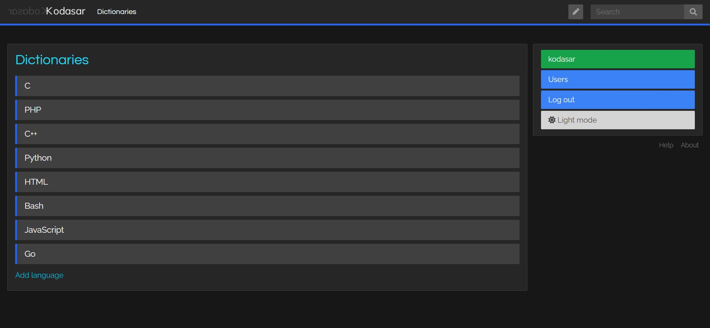

# Kodasar

Kodasar is the dictionary network for programming languages.

[Website](https://neo.kodasar.sabahlatan.com)

The [old version of Kodasar](https://kodasar.sabahlatan.com) was written in plain PHP in 2015 and had a primitive structure was and not open source.

